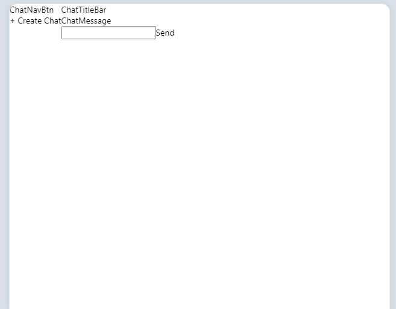
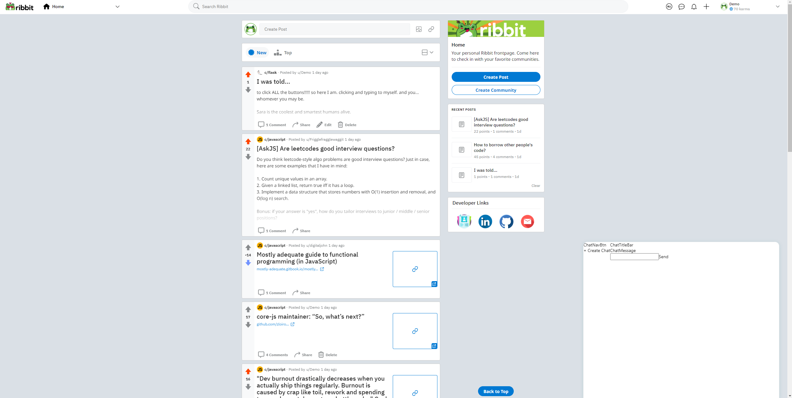

# Cloning Reddit's Live Chat Feature, Pt. 3: Frontend

## Redux

Testing

<!-- truncate -->

Before we talk about the crux of this post - the React components - let's briefly go over the Redux code.

In the redux file, `chats.js`, we have the following thunks to pair with our endpoints:

- `getUserChatThreads`
- `getChatThread`
- `createChatThread`
- `createChatMessage`
- `fakeDeleteMessage`
- `readAllMessages`

```javascript
const LOAD_CHAT_THREADS = "chat_threads/LOAD_CHAT_THREADS";
const LOAD_CHAT_THREAD = "chat_threads/LOAD_CHAT_THREAD";

const loadChatThreads = (chatThreads) => {
  return {
    type: LOAD_CHAT_THREADS,
    chatThreads,
  };
};

const loadChatThread = (chatThread) => {
  return {
    type: LOAD_CHAT_THREAD,
    chatThread,
  };
};

export const getUserChatThreads = () => async (dispatch) => {
  const response = await fetch("/api/chat_threads");

  if (response.ok) {
    const data = await response.json();
    dispatch(loadChatThreads(data));
    return data;
  }
};

export const getChatThread = (chatThreadId) => async (dispatch) => {
  const response = await fetch(`/api/chat_threads/${chatThreadId}`);
  if (response.ok) {
    const data = await response.json();
    dispatch(loadChatThread(data));
    return data;
  }
};

export const createChatThread = (receiverId) => async (dispatch) => {
  const response = await fetch("/api/chat_threads", {
    method: "POST",
    headers: { "Content-Type": "application/json" },
    body: JSON.stringify({ receiverId: receiverId }),
  });

  if (response.ok) {
    const data = await response.json();
    dispatch(loadChatThread(data));
    return data;
  }
};

export const createChatMessage = (payload) => async (dispatch) => {
  const { content, receiverId, chatThreadId } = payload;
  const response = await fetch(`/api/chat_threads/${chatThreadId}/messages`, {
    method: "POST",
    headers: { "Content-Type": "application/json" },
    body: JSON.stringify({
      content: content,
      receiver_id: receiverId,
    }),
  });

  if (response.ok) {
    const data = await response.json();
    return data;
  } else if (response.status < 500) {
    const data = await response.json();
    if (data.errors) {
      return data;
    }
  } else {
    return ["An error occurred. Please try again."];
  }
};

export const createReaction = (payload) => async (dispatch) => {
  const { emoji, userId, messageId } = payload;

  const response = await fetch(`/api/messages/${messageId}/reactions`, {
    method: "POST",
    headers: { "Content-Type": "application/json" },
    body: JSON.stringify({
      emoji,
      user_id: userId,
    }),
  });

  if (response.ok) {
    const data = await response.json();
    return data;
  } else if (response.status < 500) {
    const data = await response.json();
    if (data.errors) {
      return data;
    }
  } else {
    return ["An error occurred. Please try again."];
  }
};

export const fakeDeleteMessage = (messageId) => async (dispatch) => {
  const response = await fetch(`/api/chat_threads/messages/${messageId}`, {
    method: "PUT",
    headers: { "Content-Type": "application/json" },
  });

  if (response.ok) {
    const data = await response.json();
    return data;
  }
};

export const readAllMessages = (threadId) => async (dispatch) => {
  const response = await fetch(`/api/chat_threads/${threadId}/read`, {
    method: "PUT",
    headers: { "Content-Type": "application/json" },
  });

  if (response.ok) {
    const data = await response.json();
    return data;
  }
};

const initialState = {};

export default function chatThreadReducer(state = initialState, action) {
  switch (action.type) {
    case LOAD_CHAT_THREADS:
      if (action.chatThreads && action.chatThreads.ChatThreads) {
        return action.chatThreads.ChatThreads.reduce(
          (chatThreads, chatThread) => {
            chatThreads[chatThread.id] = chatThread;
            return chatThreads;
          },
          {}
        );
      }
      return state;

    case LOAD_CHAT_THREAD:
      return { ...state, [action.chatThread.id]: action.chatThread };

    default:
      return state;
  }
}
```

## Setting Up the Frontend

We have finally made it to the meat of this feature - the React components that sit in the `src/` file on the frontend. Hooray! Give yourself a knuckle-touch.

### File Structure & Initial Setup

As it stands, our frontend is currently pretty bare, so we need to create some components. Let's go ahead and create a folder structure diagram.

```

Chat/
├─ ChatLeft/
│  ├─ ChatLeft.js
│  ├─ ChatNav.js
│  └─ ChatNavBtn.js
│
├─ ChatRight/
│  ├─ ChatRight.js
│  ├─ ChatTitleBar.js
│  │
│  ├─ ChatInput/
│  │  ├─ ChatInput.js
│  │  └─ ChatEmojis.js
│  │
│  ├─ ChatMessages/
│  │  ├─ ChatMessages.js
│  │  └─ ChatMessage.js
│  │
├─ ChatOverlays/
│  ├─ WelcomeOverlay.js
│  ├─ NewChatOverlay.js
│  ├─ InviteOverlay.js
│  └─ DeleteMsgOverlay.js
│
├─ Chat.js
└─ Chat.css
```

We start with our overall folder, `Chat` - specifically our main component, `Chat.js`.

The chat window is divided into two main parts - the left side and the right side - so we decided to structure the folders like that by creating a `ChatLeft/` folder and a `ChatRight/` folder. We also have `ChatOverlays` to hold the handful of overlays we need. Since these overlays are absolutely positioned, they aren't necessarily in the `ChatRight` group, and we can keep them in a general place instread.

Create all of these files and folders before we move on. As you create each file, take a moment to create the React function and its container div. Here, we do it for `Chat.js`, `ChatLeft.js`, and `ChatNav.js`. Do the same for the right side and the overlays.

```javascript
// Chat.js
import React from "react";
import ChatLeft from "./ChatLeft/ChatLeft";
import ChatRight from "./ChatRight/ChatRight";

const Chat = () => {
  return (
    <div className="chat-container">
      <ChatLeft />
      <ChatRight />
    </div>
  );
};

export default Chat;
```

```javascript
// ChatLeft.js
import ChatNav from "./ChatNav";

const ChatLeft = () => {
  return (
    <div className="chat-left-container">
      <ChatNav />
    </div>
  );
};

export default ChatLeft;
```

```javascript
// ChatNav.js
import ChatNavBtn from "./ChatNavBtn";

const ChatNav = () => {
  return <div className="chat-nav-container"></div>;
};

export default ChatNav;
```

Note that for `ChatNav`, we import ChatNavBtn and leave it for now. Since we'll be mapping to that component, we don't need it just yet.

Once all of the files are set up, we can move on to initial styling.

### Initial Styling

It's hard to manually test a feature if it doesn't exist physically, so we need to set up some basic styling including the chat window's layout, the general size of each component, giving the feature a background, etc.

```css
.chat-container {
  width: 632px;
  height: 506px;
  bottom: 0;
  right: 1.875rem;
  border-radius: 1rem 1rem 0 0;
  box-shadow: 0 0.125em 0.75em 0.125em rgba(20, 120, 120, 0.11);
  top: auto;
  position: fixed;
  overflow: hidden;
  background: white;
  z-index: 9999;
  border: 1px solid #edeff1;
  border-bottom: none;
  font-family: system-ui, "Segoe UI", Roboto, Helvetica, Arial, sans-serif,
    "Apple Color Emoji", "Segoe UI Emoji", "Segoe UI Symbol";
  display: flex;
}
```

This is all of the css we'll need for `.chat-container`, and results in this:

<center>



</center>

It also gives it the correct placement on the page, as seen here:



:::info Regarding the font family used in `.chat-container`

```css
font-family: system-ui, "Segoe UI", Roboto, Helvetica, Arial, sans-serif,
  "Apple Color Emoji", "Segoe UI Emoji", "Segoe UI Symbol";
```

This is known as a **native font stack** or **system font stack**. It essentially uses the operating system's default system font, accounting for all of the major operating systems used today (macOS, Windows, Android, Ubuntu). Using this can help boost performance because the browser doesn't have to download any font files since it's using one it already had.

Reddit actually uses

```css
font-family: -apple-system, BlinkMacSystemFont, "Segoe UI", Roboto,
  "Helvetica Neue", Arial, "Apple Color Emoji", "Segoe UI Emoji",
  "Segoe UI Symbol", sans-serif;
```

However, according to a [thorough write-up](https://css-tricks.com/implementing-system-fonts-booking-com%E2%80%8A-%E2%80%8Aa-lesson-learned/) published by Booking.com, using snippets starting with `-apple-system` may cause some browsers to view the leading font as a vendor prefix that will be ignored.

Chrome and Safari recently shipped "system-ui", which is a generic font family that can be used in place of `-apple-system` and `BlinkMacSystemFont`, and is the font family we're using today.
:::

Follow this by adding the following css code:

```css
.chat-left-container {
  height: 100%;
  display: flex;
  flex-direction: column;
  justify-content: space-between;
  border-right: 1px solid #edeff1;
  max-width: 220px;
  width: 100%;
}

.chat-right-container {
  height: 100%;
  width: 100%;
  display: flex;
  flex-direction: column;
}

.chat-nav-container {
  display: flex;
  flex-direction: column;
  overflow-y: auto;
}

.chat-messages-container {
  overflow: hidden auto;
  height: 100%;
  width: 100%;
  flex: 1 0 0px;
}

.chat-input-container {
  padding: 8px;
  display: flex;
  align-items: center;
  position: relative;
}
```

After applying this code, our chat component looks like this:

<center>


</center>

As you can see, this successfully lays out our components and makes sure they're all of the correct size and placement. The component names have been left in to accurately show where our components are, but you don't necessarily need to leave them in yourself.
